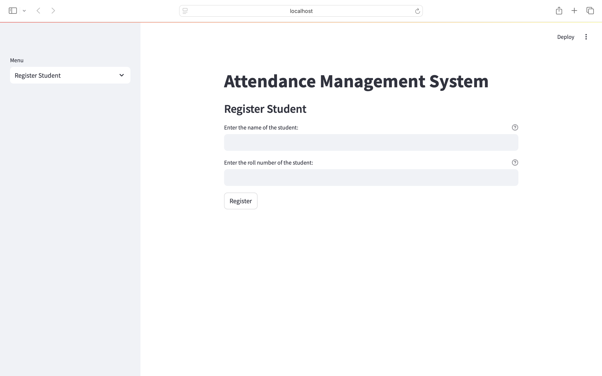
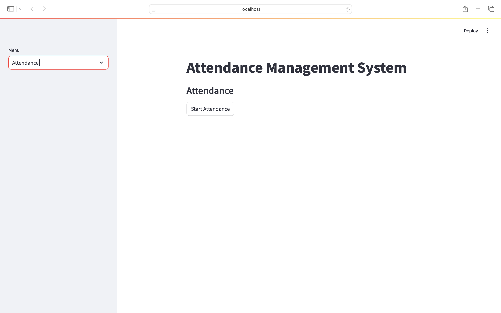
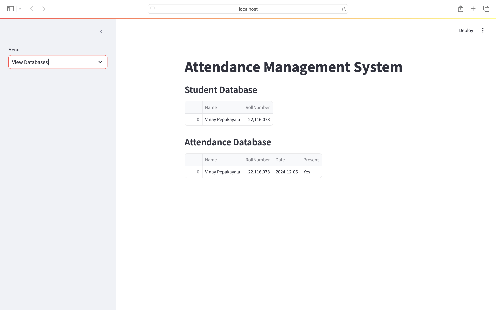

# Attendance Management System

This project is an Attendance Management System that uses facial recognition to mark attendance. It is built using OpenCV, Streamlit, and other Python libraries.

## Features

- Register new students with their name and roll number.
- Capture images of students for training the facial recognition model.
- Train the facial recognition model using the captured images.
- Recognize faces in real-time and mark attendance.
- View the student and attendance databases.

## Requirements

Install the required Python packages using the following command:

```bash
pip install -r 

requirements.txt


```

## Usage

### Register a Student


1. Run the Streamlit app:
    ```bash
    streamlit run app.py
    ```
2. Select "Register Student" from the sidebar menu.
3. Enter the student's name and roll number.
4. Click "Register" to capture images and train the model.

### Mark Attendance

1. Run the Streamlit app:
    ```bash
    streamlit run app.py
    ```
2. Select "Attendance" from the sidebar menu.
3. Click "Start Attendance" to start the live face recognition and mark attendance.

### View Databases

1. Run the Streamlit app:
    ```bash
    streamlit run app.py
    ```
2. Select "View Databases" from the sidebar menu.
3. View the student and attendance databases.

## File Structure

- `app.py`: Main Streamlit app file.
- `takeimages.py`: Script to capture images of students.
- `train.py`: Script to train the facial recognition model.
- `test.py`: Script to recognize faces and mark attendance.
- `requirements.txt`: List of required Python packages.
- `students.csv`: CSV file to store student details.
- `attendance.csv`: CSV file to store attendance records.
- `TrainingImage`: Directory to store captured images.
- `TrainingImageLabel`: Directory to store trained model and label files.

## Acknowledgements

- OpenCV for providing the tools for image processing and facial recognition.
- Streamlit for creating an easy-to-use web interface.
